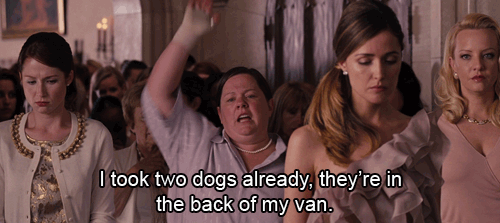

# Python Object Relationships - One to Many
Talk about how

## Introduction
In this lab we are going to practice creating a one to many relationship. We've learned how a belongs to relationship works -- with the belongs to class knowing the one instance is is associated with. Now what if we thing about it from the other side? Let's say we are talking about a `Person` class and a `Dog` class. We know the `Dog` belongs to one `Person`, but that doesn't mean the person can't have more than one dog, right?



So, a dog still needs to know who its owner is, but we now know that an owner can have **many** dogs. Let's get started!

## Objectives
* Create a one to many domain model
* Practice querying an intance to demonstrate the one to many relationship
* THREE

## Defining Our Classes

Let's start by defining two classes, `Owner` and `Car`. 
* An owner should be instantiated with at least a `name` and an `age`. 
* A car should be instantiated with at least a `make`, `model`, and `year`. 
* The relationship between the two classes should be such that an owner has many cars and a car belongs to an owner. It is our job to make sure our classes and instances are set up to show this. 
* Think about which class(es) also must have an `_all` class variable, and be sure to have setter and getter (read and write) instance methods for each attribute for an owner and for a car as well as a class method that returns the `_all` list.


```python
from owner import Owner
jake = Owner("Jake", 25)
jess = Owner("Jess", 29)
alexa = Owner("Alexa", 33)
pete = Owner("Pete", 30)
```


```python
from car import Car
# create several instances of the Car class and associate them to owners. 
# remember owners can have more than one car associated with them, but a car can only have one owner
```

## Querying For Our Cars

Okay, now that we have our classes set up, let's stat to work with them. Let's say Alexa and Pete both have several cars and it has gotten to the point that they are forgetting about some of them -- like when winter is over and you're re-discovering the bathing suits you stuffed into the abyss of your closet. Yes, Alexa and Pete are doing well for themselves.
Since we don't want them to lose track of their cars, let's write an instance method that prints out the makes and models of each car that they own, respectively. Let's call this method `find_my_cars`. It should return a list of strings which are the name of the car's make concatenated with the car's model. (i.e. `["Toyota Highlander", "Audi Q7", "Jeep Wrangler"]`)


```python
alexa.find_my_cars()
```


```python
pete.find_my_cars()
```

## TITLE

## Summary
SUMMARY
